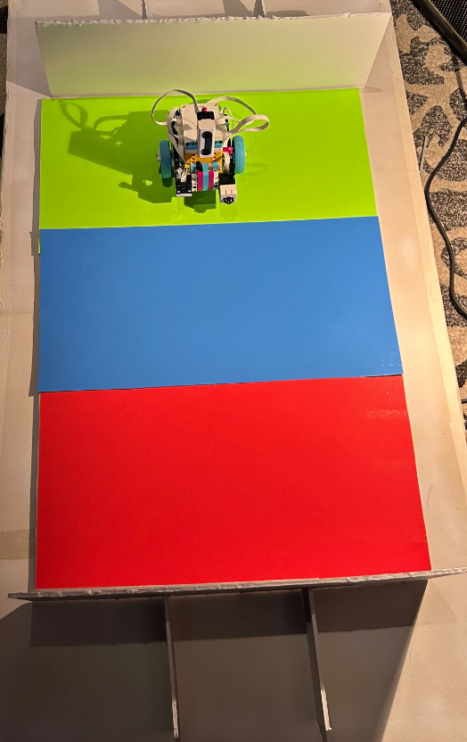
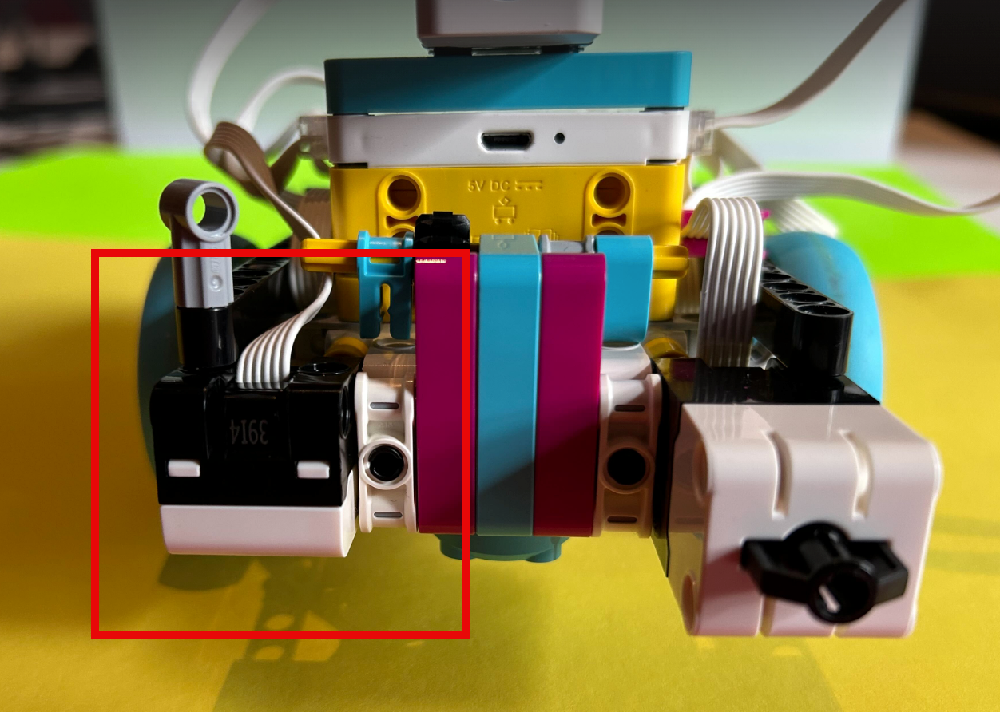

# LEGO Contamination Sorter – Salesforce + Pybricks Bridge

This project connects a LEGO SPIKE Prime robot running Pybricks to Salesforce using the Pub/Sub API.  
It listens for **LEGO_Command__e** platform events and drives the robot to the correct zone (Recycling OK, Contaminated, Inspection).
It expects barriers at each end of board and turns around before hitting them.
It also knows color placement order on the board (Green->Yellow->Red) and has logic to turn around if going the wrong way.
After reaching the zone, it publishes back a **LEGO_Robot_Status__e** event.

---

## Board Layout



---

## Sensor Placement

The downward-facing Color Sensor is positioned like this:



---

## Build the LEGO Robot

We use LEGO’s official drive bases for reliable motor and sensor placement.

### 1. Start with **Driving Base 1**  
https://spike.legoeducation.com/prime/models/bltc58e302d70cf6530

Provides:
- Dual-motor drive  
- Stable chassis  
- Correct motor spacing & alignment  

---

### 2. Add Distance Sensor system from **Driving Base 2 – Tools & Accessories**  
https://spike.legoeducation.com/prime/models/blte7efff9c7c96c9cb

Adds:
- Front-mounted sensor brackets  
- Extension arm  
- Better rigidity for front sensors  

---

### 3. Add Color & Ultrasonic Sensors

| **Sensor Type**       | **Port** | **Notes** |
|-----------------------|----------|-----------|
| **Color Sensor**      | Port **B** | Mounted downward on the black grabber arm to detect colored zones (see photo). |
| **Ultrasonic Sensor** | Port **F** | Detects obstacles and allows stopping ~2 inches before the box. |

Your build should match the photos above for proper accuracy and alignment.

---

## How It Works – Architecture Overview

1. **Salesforce**
   - Agent or automation publishes a *LEGO_Command__e* event:
     - `Command__c` = `RECYCLING_OK`, `CONTAMINATED`, or `INSPECTION`
     - `Case_Id__c` = the originating Case Id
   - The robot returns a *LEGO_Robot_Status__e* event:
     - `Case_Id__c`
     - `Message__c` (e.g., “Target Zone Reached”)

2. **Python Bridge (`bridge_pybricks.py`)**
   - Subscribes to Salesforce Pub/Sub  
   - When a command arrives:
     - Runs `pybricksdev run ble contamination_sorter.py`
     - Parses `STATUS:` output lines  
     - Publishes a Robot Status PE back to Salesforce

3. **Pybricks Program (`contamination_sorter.py`)**
   - Uses **reflection values**, not color names  
   - Detects RED / YELLOW / GREEN zones  
   - Drives to the appropriate zone  
   - Prints `STATUS:` lines that the bridge forwards to Salesforce  

---

## Color Detection (Reflection-Based)

The Color Sensor `.color()` readings are unreliable for this board, so `.reflection()` is used.

Use **color_calibrater.py** to measure reflection values on each zone.
pybricksdev run ble color_calibrater.py and notice REF values on each color and replace in contamination_sorter.py as shown here:

### Example classifier

```python
# ==========================================
# --- COLOR CALIBRATION VALUES (EDIT HERE) ---
# ==========================================
CAL_RED    = 5
CAL_GREEN  = 11
CAL_YELLOW = 13.5  # Range 13-15

# Filter out readings that are way off
```

---

## Salesforce Setup

### 1. Connected App (External Client App)

Name: **Lego Agent Bridge**  
Callback URL: `http://localhost:8080/callback`

Scopes:
- Manage user data via APIs (`api`)
- Full access (`full`)
- Refresh tokens (`refresh_token`, `offline_access`)
- Access the Salesforce API Platform (`sfap_api`)

Create file:

```json
// sf_config.json
{
  "CLIENT_ID": "xxxx",
  "CLIENT_SECRET": "xxxx"
}
```

---

### 2. Platform Events

#### **LEGO_Command__e**
| Field | Purpose |
|-------|---------|
| `Command__c` | `RECYCLING_OK`, `CONTAMINATED`, `INSPECTION` |
| `Case_Id__c` | originating Case ID |

#### **LEGO_Robot_Status__e**
| Field | Purpose |
|-------|---------|
| `Case_Id__c` | echoed ID |
| `Message__c` | e.g., “Target Zone Reached” |

---

### Test with Anonymous Apex

```apex
LEGO_Command__e eventRecord = new LEGO_Command__e(
    Command__c = 'INSPECTION',
    Case_Id__c = '500KZ00000F7XmZYAV'
);
Database.SaveResult sr = EventBus.publish(eventRecord);
System.debug('SR: ' + sr);
```

---

## Pybricks Firmware Installation

Steps:

- Go to https://code.pybricks.com  
- Click the **Bluetooth icon**, select your hub, and install  
- If Bluetooth scanning doesn’t work:
  - Go to `chrome://flags`
  - Enable **Experimental Web Platform Features**
- If Bluetooth still fails:
  - Hold the hub's Bluetooth button  
  - Plug USB cable into laptop (flashing **pink → green → blue**)  
- On Windows 11, you may need the **WinUSB** driver from Pybricks troubleshooting wizard  

---

## Laptop Setup

### Create environment & install dependencies

```bash
python3 -m venv venv
source venv/bin/activate
pip install -r requirements.txt
```

### Required packages

- pybricksdev  
- grpcio  
- fastavro  
- aiohttp  
- requests  

---

## Running the System

Get oAuth credentials by logging in and Start the bridge:

```bash
python sf_login.py
python bridge_pybricks.py
```

Then trigger a command using Salesforce Debug Anonymous.

---

## Project Files

- `bridge_pybricks.py`
- `salesforce_pubsub.py`
- `contamination_sorter.py`
- `color_calibrater.py`
- `sf_login.py`
- `sf_config.json` (local only)
- `robot_board.png`
- `sensor_placement.png`

---

## Troubleshooting
- Most issues are with color detection.
Use **color_calibrater.py** to measure reflection values on each zone (manually move robot around).
pybricksdev run ble color_calibrater.py 
and notice REF values on each color and replace in contamination_sorter.py as shown here:
- If robot doesn’t move:
  ```bash
  pybricksdev run ble contamination_sorter.py
  ```
- If STATUS lines don’t appear:  
  Ensure your Pybricks script prints `STATUS:...`


